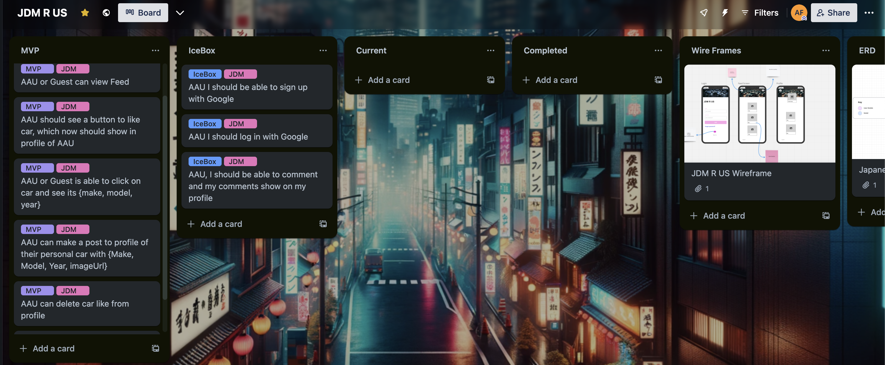

# Project Proposal

## Project Choice 

- [ ] Japanese Car DB

## Project Description 

This project involves developing a backend CRUD (Create, Read, Update, Delete) application that provides a comprehensive API for car information, complemented by a frontend designed as a virtual car meet. Users can access and manage data about various car makes and models, including details like year and specifications. The application is built using Node.js and Express for server-side operations, with MongoDB as the database, and Mongoose for database schema definition and interaction. Key features include the ability to add new car entries, retrieve car details, update existing information, and delete entries, all within an engaging virtual environment where car enthusiasts can explore and connect. The API and frontend interactions will be rigorously tested using tools like Postman or Insomnia. Additional features may include user authentication and enhanced data handling with filtering, sorting, and pagination, enhancing the virtual car meet experience.

## Wire Frames
 

## User Stories

#### MVP Goals

- Effortless Profile Creation: As an Authenticated User (AAU), effortlessly set up and personalize your user profile.
- Seamless Browsing Experience: Whether as an AAU or a Guest, easily navigate through the feed for the latest updates and access comprehensive car details (make, model, year).
- Update with Ease: As an AAU, conveniently modify car information on the feed.
- Simple Deletion Process: Effortlessly remove car listings from the feed as an AAU.
- Hassle-Free Car Listing: As an AAU, smoothly add new car entries to the feed.


#### Stretch Goals

- Streamlined Google Registration: As an Authenticated User (AAU), enjoy the convenience of a quick and secure sign-up process using your Google account.
- Engaging Commenting Feature: Make meaningful contributions to discussions with the insightful commenting feature. Your thoughtful comments will not only enliven conversations but will also be prominently featured on your profile for others to explore.
- Interactive 'Like' Functionality: Express your appreciation for cars with the 'like' feature. As an AAU, your likes on various cars will be elegantly displayed in your profile, adding a personal touch to your online presence.
- Personal Car Showcase: Share your passion for cars by featuring your own vehicles on your profile. Display your personal collection, complete with make, model, year, and images, creating a unique and personal automotive gallery.
- Dynamic Profile Updates: Experience real-time updates on your profile. Every new 'like' you give is instantly reflected, keeping your profile continuously current and engaging.


#### ERD 

 
### Trello Board
)

#### Timeline - Daily Accountability
Weekdays (Monday to Friday)
Morning
* 7:00 AM - 8:00 AM: Wake up and have breakfast
* 8:00 AM - 9:00 AM: Gym session (1 hour)
* 9:30 AM - 1:30 PM: Coding session (4 hours)
Afternoon
* 1:30 PM - 2:30 PM: Lunch break
* 2:30 PM - 5:30 PM: Flexible time (additional coding, rest, or other activities)
Evening
* 6:00 PM - 7:00 PM: Dinner
* 7:00 PM - 9:00 PM: Relaxation/Free Time
* 9:00 PM - 10:00 PM: Wind down/Prepare for bed
* 10:00 PM: Sleep
Weekends (Saturday and Sunday)
Morning
* 8:00 AM - 9:00 AM: Wake up and have breakfast
* 9:30 AM - 10:30 AM: Gym session (1 hour)
* 11:00 AM - 12:00 PM: Leisurely activity or additional coding
Afternoon
* 12:00 PM - 1:00 PM: Lunch
* 1:00 PM - 4:00 PM: Free time (could be used for coding if desired)
Evening
* 6:00 PM - 7:00 PM: Dinner
* 7:00 PM onwards: Relaxation/Free Time
* 10:00 PM: Sleep
Special Days: Christmas Eve and Christmas Day
Christmas Eve (December 24)
* Follow the weekend schedule.
* Evening: Celebrate Christmas Eve (adjust bedtime as needed).
Christmas Day (December 25)
* Enjoy a relaxed day with minimal coding.
* Engage in Christmas activities and celebrations.
* Meals and gym as per comfort and possibility.
Notes
* Coding: Aim for at least 4 hours of coding per day, but feel free to adjust based on your workload and energy levels.
* Gym: Consistent gym time helps maintain physical health and mental clarity.
* Sleep: Prioritize 8 hours of sleep to ensure rest and recovery.
* Flexibility: Adjust the schedule as needed, especially on weekends and holidays.


### Game Pseudocode - 

```  ```


